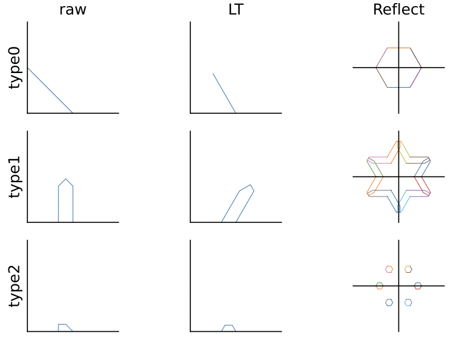
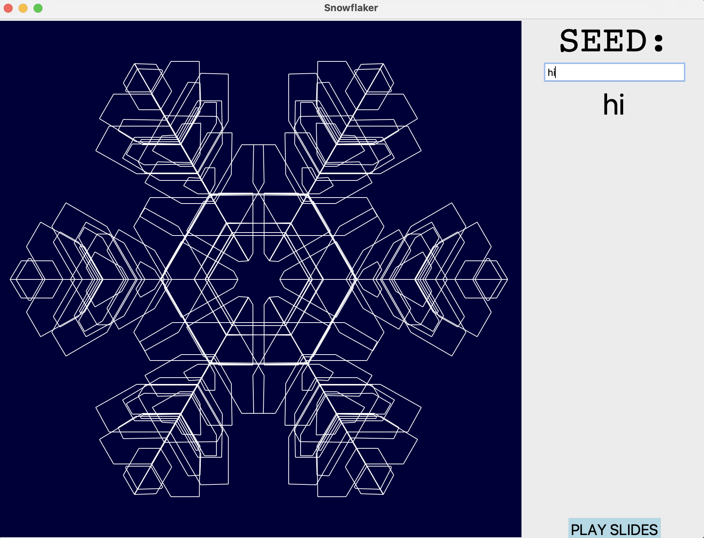

> 这个小程序是我高中毕业前用python3写的一个带GUI的小程序，可以把输入的文字内容作为随机数种子生成雪花状图案。当时我把全班同学的名字都存在一个文本文件里，然后像ppt一样播放了用每个人的名字生成的雪花。

## 运行环境

需要安装`Python3`. 

基于python3自带的`tkinter`绘制GUI，可在**Windows, Mac OS, Linux**平台运行.

## 使用方法

1. 打开

   双击运行 `Snowflaker.pyw`.

   **或**

   进入项目目录下，在终端输入:

   ```bash
   python3 Snowflaker.pyw
   ```

2. 用法

   - 在文本框内输入随机数种子，程序自动给出生成的雪花状图案。

   - 点击右下角的按钮，则会根据`list.txt`逐行生成图案并显示。

## 基本思路

每次摇一串随机数，生成一条折线段，我这里设计了三种类型的折线段:



设计的时候图方便用的是raw这列的左边，实际图形要经过一个线性变换到LT这一列的形状，再经过旋转、反射，最终形成最右边一列共12组折线段（type0有重叠所以看起来像是6组）。

然后重复上述步骤数次，最后再补上3条长度适当的主干：y=0，y=(√3)\*x，y=(-√3)\*x，一个雪花图案就形成啦~

